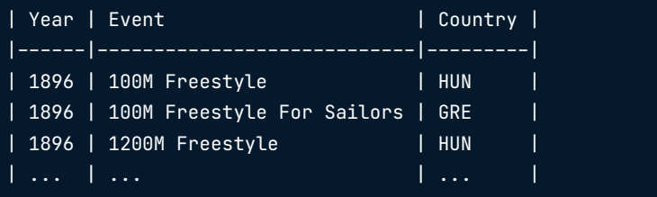
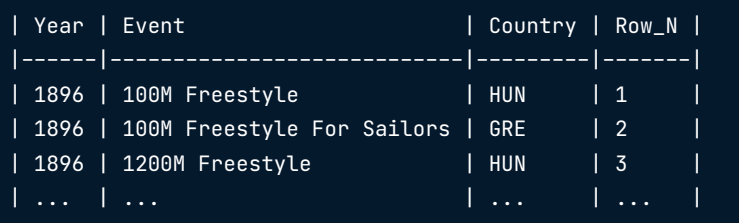
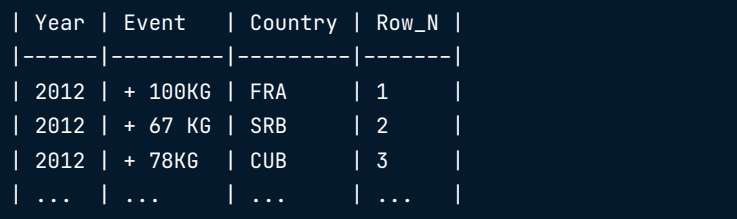
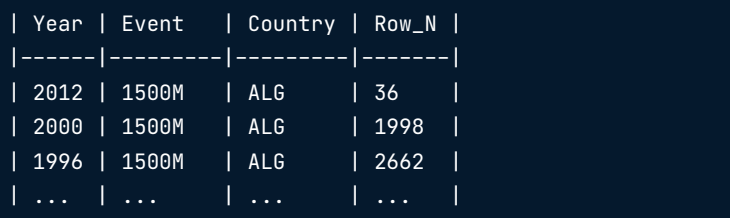

# Advanced SQL - DB: Postgres

---

# Window Function

---

## Introduction

---

```sql
SELECT
	year, 
    event, 
    country
FROM Summer_Medals
WHERE 1=1 
	AND Medal = 'Gold'
;
```



- Using `ROW_NUMBER`

```sql
SELECT
	year, 
	event, 
	country,
	ROW_NUMBER() OVER () AS Row_N
FROM Summer_Medals
WHERE 1=1
	AND Medal = 'Gold'
;
```



### Anatomy of a window function

FUNCTION_NAME() OVER (...)
- ORDER BY
- PARTITION BY
- ROWS/RANGE PRECEDING/FOLLOWING/UNBOUNDED

> ORDER BY in OVER orders the rows related to the current rows. Example: Ordering by year in descending order in ROW_NUMBER 's OVER clause will assign 1 to the most recent year's rows

- Order By

```sql
SELECT
	year, 
	event, 
	country,
	ROW_NUMBER() OVER (ORDER BY year DESC) AS Row_N
FROM Summer_Medals
WHERE 1=1
	AND Medal = 'Gold'
;
```


- Order by multiple columns

```sql
SELECT
	year, 
	event, 
	country,
	ROW_NUMBER() OVER (ORDER BY year DESC, event ASC) AS Row_N
FROM Summer_Medals
WHERE 1=1
	AND Medal = 'Gold'
;
```



- Ordering in- and outside OVER

```sql
SELECT
	year, 
	event, 
	country,
	ROW_NUMBER() OVER (ORDER BY year DESC, event ASC) AS Row_N
FROM Summer_Medals
WHERE 1=1
	AND Medal = 'Gold'
ORDER BY country ASC, Row_N ASC
;
```



> **ORDER BY** `inside` OVER takes effect before **ORDER BY** `outside` OVER

### LEAD, LAG


---

## Fetching

---


---

## ranking

---


---

## paging

---


---

## Aggregate window functions

---


---

## frames

---


