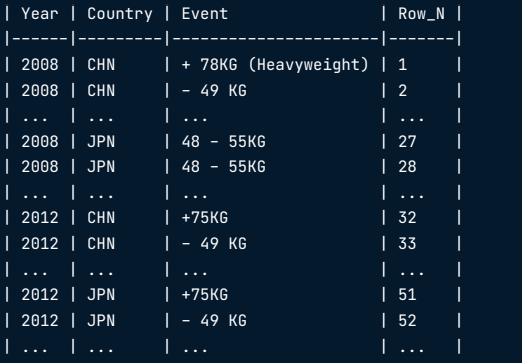

# Interview

---

# Data Analyst - Daraz Bangladesh

---

## Phase 1 : SQL Coding Assignment

---

### Tables




### Question & Solution

- DATABASE: PostgreSQL

1. Select Customer_Name, Product_Name, Trans_Time, Quality, Amount

```sql
select 
	usr.customer_name ,
	prod.product_name ,
	tr.order_create_date as trans_time,
	tr.quantity,
	tr.gmv as amount
from trd_bd tr
inner join usr_bd usr on tr.buyer_id = usr.buyer_id 
inner join prd_bd prod on prod.product_id = tr.product_id 
;
```

2. Select all transaction for Cumtomer_Name Starts with "A"

```sql
select 
	usr.customer_name ,
	prod.product_name ,
	tr.order_create_date as trans_time,
	tr.quantity,
	tr.gmv as amount
from trd_bd tr
inner join usr_bd usr on tr.buyer_id = usr.buyer_id 
inner join prd_bd prod on prod.product_id = tr.product_id 
where 1=1
	and usr.customer_name like 'A%' -- assume case sensitive 
;
```

3. Customer Name wise Total GMV

```sql
select 
	usr.customer_name ,
	sum(tr.gmv) as total_gmv
from trd_bd tr
inner join usr_bd usr on tr.buyer_id = usr.buyer_id 
where 1=1
group by usr.customer_name 
;
```

4. Date wise Total GMV

```sql
select 
	tr.order_create_date as trans_time,
	sum(tr.gmv) as total_gmv
from trd_bd tr
where 1=1
group by tr.order_create_date 
;
```


5. Daily total GMV for afternoon 16th DEC 2021


```sql
select 
	tr.order_create_date as trans_time,
	sum(tr.gmv) as total_gmv
from trd_bd tr
where 1=1
and tr.order_create_date >= '2021-12-16' 
and tr.order_create_date < '2021-12-17'
group by tr.order_create_date 
; -- order_create_date missing time part
```

6. Product Name wise unit Price


```sql
select 
	prod.product_name ,
	(tr.gmv/tr.quantity) as unit_price
from trd_bd tr
inner join prd_bd prod on prod.product_id = tr.product_id 
where 1=1
group by 1 ,2
;
```

7. Product wise daily avg sell quantity

```sql
select 
	tr.order_create_date as trans_time,
	prod.product_name ,
	avg(tr.quantity) as avg_sell_quantity
from trd_bd tr
inner join prd_bd prod on prod.product_id = tr.product_id 
where 1=1
group by 1,2
order by 1,2
;
```


8. Total quantity sold for product "PROD_2" with using “Left Outer Join”

```sql
select 
	prod.product_name ,
	SUM(tr.quantity) as total_quantity
from trd_bd tr
left join prd_bd prod on prod.product_id = tr.product_id 
where 1=1
and prod.product_name = 'product_2'
group by prod.product_name 
;
```


9. Customer wise balance after all the transaction for all 5 customers


```sql
select 
	usr.customer_name ,
	sum(tr.gmv) as amount	-- balance or total amount of trnx? No balance field exists for customer.
from trd_bd tr
inner join usr_bd usr on tr.buyer_id = usr.buyer_id 
inner join prd_bd prod on prod.product_id = tr.product_id 
where 1=1
group by 1
;
```

10.	Customer wise day end balance of 15th Dec 2021

No balance column exists for customers in the tables. So can't figure it out


11.	Customer wise highest transaction amount

```sql
select 
	usr.customer_name ,
	max(tr.gmv) as highest_trnx_amount	
from trd_bd tr
inner join usr_bd usr on tr.buyer_id = usr.buyer_id 
inner join prd_bd prod on prod.product_id = tr.product_id 
where 1=1
group by usr.customer_name
;
```

12.	Product name wise transaction amount in product wise different column

```sql
select 
	sum(coalesce(product1,0)) as product1,
	sum(coalesce(product2,0)) as product2,
	sum(coalesce(product3,0)) as product3
from 
(
	select 
		case when product_name='product_1' then total_quantity end as product1,
		case when product_name='product_2' then total_quantity end as product2,
		case when product_name='product_3' then total_quantity end as product3
	from 
	(
		select 
			prod.product_name ,
			SUM(tr.quantity) as total_quantity
		from trd_bd tr
		left join prd_bd prod on prod.product_id = tr.product_id 
		where 1=1
		group by prod.product_name 
	)tbl
)tbl2
;
```


13.	Create a table name “TBL_SMRY” having the Customer_Name, Product_Name total_Transaction_Quantity, Total_GMV

```sql
create table TBL_SMRY as 
select 
	usr.customer_name ,
	prod.product_name ,
	sum(tr.quantity) as total_Transaction_Quantity,
	sum(tr.gmv) as Total_GMV
from trd_bd tr
inner join usr_bd usr on tr.buyer_id = usr.buyer_id 
inner join prd_bd prod on prod.product_id = tr.product_id 
where 1=1
group by 1,2
;
```

14.	When do we use Partitioning? What are the types of partition?


> partition is a process of splits a table into multiple parts. when perform a query on a table then depends on the partition the execution will perform on the associate portioned table
when a table produces a large number of transactions or may be the table have crores of transaction then partition is helpful. Commonly the transactional table needs to be partitioned properly. Partition reduces the time when perform a query on the table. 

**Types of partition:**
1. LIST PARTITION 
2. RANGE PARTITION 
3. HASH PARTITION 
4. MULTILEVEL PARTITION 

**Example** 
1. if range partition on (create_date) then daily transaction will be inserted into separated table for the day only.
2. if list partition then different bank data will be inserted into different partitioned table using the bank column

> partition needs to be maintained properly daily/monthly/yearly basis using daily jobs.


15.	 Please mentioned some of the BI tools you are familiar with.

**Some of the BI tools are given below:**
1. Google Data Studio
2. Tableau
3. Power BI

---

## Phase 2 : Technical Interview

---

1. Some joining related problems.

2. coalesce() function and its uses. 

3. How do you use coalesce() function instead of case statement to segments amount like `0-1000 --> small`, `1001-5000 --> mediam`, `5001 + --> large`

4. rank() vs dense_rank() with appropriate example.

---


