# Advanced SQL - DB: Postgres

---

# Window Function

---

## Introduction

---

```sql
SELECT
	year, 
    event, 
    country
FROM Summer_Medals
WHERE 1=1 
	AND Medal = 'Gold'
;
```

**Output**

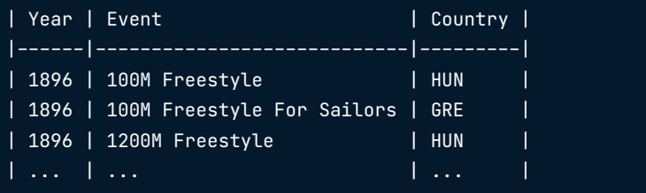

---

- Using `ROW_NUMBER`

```sql
SELECT
	year, 
	event, 
	country,
	ROW_NUMBER() OVER () AS Row_N
FROM Summer_Medals
WHERE 1=1
	AND Medal = 'Gold'
;
```

**Output**

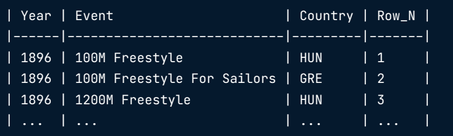

---

### Anatomy of a window function

FUNCTION_NAME() OVER (...)
- ORDER BY
- PARTITION BY
- ROWS/RANGE PRECEDING/FOLLOWING/UNBOUNDED

> ORDER BY in OVER orders the rows related to the current rows. Example: Ordering by year in descending order in ROW_NUMBER 's OVER clause will assign 1 to the most recent year's rows

---

- Order By

```sql
SELECT
	year, 
	event, 
	country,
	ROW_NUMBER() OVER (ORDER BY year DESC) AS Row_N
FROM Summer_Medals
WHERE 1=1
	AND Medal = 'Gold'
;
```

**Output**

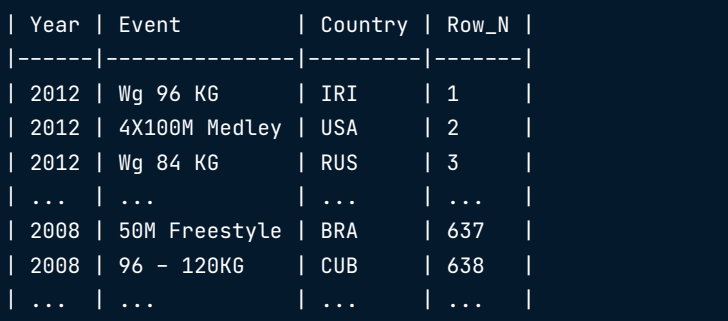

---

- Order by multiple columns

```sql
SELECT
	year, 
	event, 
	country,
	ROW_NUMBER() OVER (ORDER BY year DESC, event ASC) AS Row_N
FROM Summer_Medals
WHERE 1=1
	AND Medal = 'Gold'
;
```

**Output**

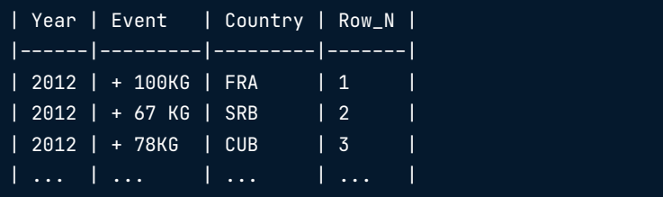

---

- Ordering in- and outside OVER

```sql
SELECT
	year, 
	event, 
	country,
	ROW_NUMBER() OVER (ORDER BY year DESC, event ASC) AS Row_N
FROM Summer_Medals
WHERE 1=1
	AND Medal = 'Gold'
ORDER BY country ASC, Row_N ASC
;
```

**Output**

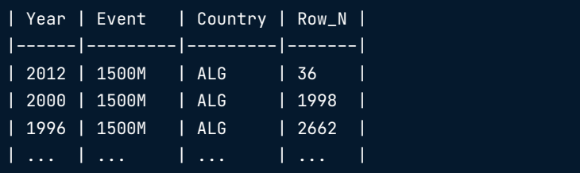

> **ORDER BY** `inside` OVER takes effect before **ORDER BY** `outside` OVER

---

### LEAD, LAG

---

- Current Champion

```sql
SELECT
	year, 
	country AS Champion
FROM summer_medals
WHERE
AND year IN (1996, 2000, 2004, 2008, 2012)
AND gender = 'Men' AND medal = 'Gold'
AND event = 'Discus Throw'
;
```

**Output**

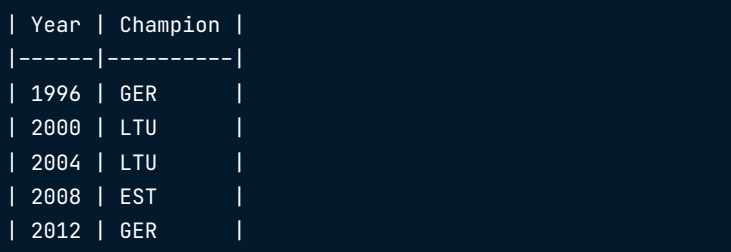

---

- Current and Last champion

```sql
WITH discus_gold AS (
	SELECT
		year, 
		country AS Champion
	FROM summer_medals
	WHERE
	AND year IN (1996, 2000, 2004, 2008, 2012)
	AND gender = 'Men' AND medal = 'Gold'
	AND event = 'Discus Throw'
)
SELECT
	year, 
	champion,
	LAG(champion, 1) OVER (ORDER BY year ASC) AS last_champion
FROM discus_gold
ORDER BY year ASC
;
```

**Output**

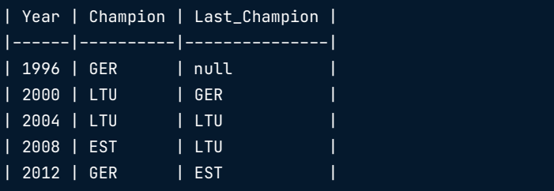

---

- Current and Last champion :: using partition - One Column

```sql
WITH discus_gold AS (
	SELECT
		year, 
		event, 
		country AS champion
	FROM summer_medals
	WHERE 1=1
	AND year IN (2004, 2008, 2012)
	AND gender = 'Men' AND Medal = 'Gold'
	AND event IN ('Discus Throw','Triple Jump')
	AND gender = 'Men'
)
SELECT
	year, 
	event, 
	champion,
	LAG(champion) OVER (PARTITION BY event ORDER BY event ASC, year ASC) AS last_champion
FROM discus_gold
ORDER BY event ASC, year asc
;
```

**Output**

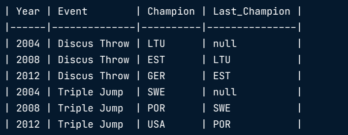

---

- **More Complex Partitioning**

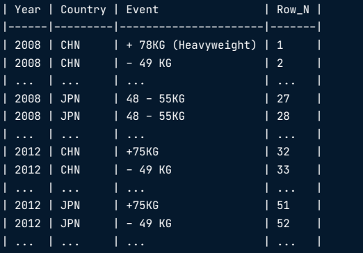


```sql
WITH country_gold AS (
	SELECT
	DISTINCT year, country, event
	FROM summer_medals
	WHERE
	year IN (2008, 2012)
	AND country IN ('CHN','JPN')
	AND gender = 'Women' AND medal = 'Gold'
)
SELECT
	year, 
	country, 
	event,
	ROW_NUMBER() OVER (PARTITION BY year, country)
FROM country_gold
;
```

**Output**

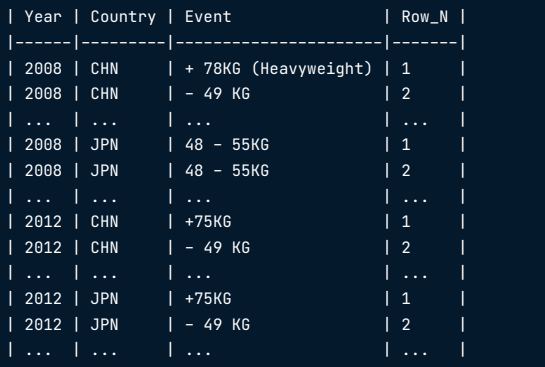


---

## Fetching

---

**The four functions**
`Relative` 
- LAG(column, n) returns column's value at the row n rows before the current row
- LEAD(column, n) returns column's value at the row n rows aer the current row
`Absolute`
- FIRST_VALUE(column) returns the rst value in the table or partition
- LAST_VALUE(column) returns the last value in the table or partition

---

- **LEAD**

```sql
WITH Hosts AS 
(
	SELECT DISTINCT year, 
	City
	FROM Summer_Medals
)
SELECT
	year, 
	city,
	LEAD(City, 1) OVER (ORDER BY Year ASC) AS Next_City,
	LEAD(City, 2) OVER (ORDER BY Year ASC) AS After_Next_City
FROM Hosts
ORDER BY Year asc
;
```

**Output**

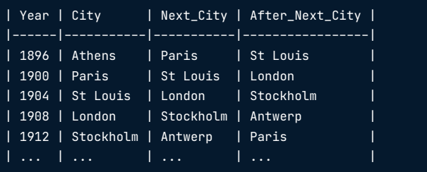

---

- **FIRST_VALUE and LAST_VALUE**

```sql
SELECT
	Year, City,
	FIRST_VALUE(City) over (ORDER BY Year ASC) AS First_City,
	LAST_VALUE(City) OVER ( ORDER BY year ASC RANGE BETWEEN UNBOUNDED PRECEDING AND UNBOUNDED FOLLOWING) AS Last_City
FROM Hosts
ORDER BY Year asc
;
```

**Output**

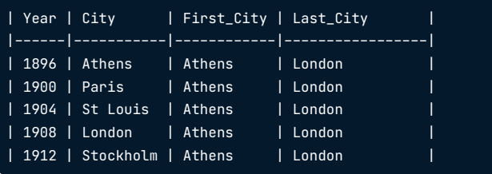

> By default, a window starts at the beginning of the table or partition and ends at the current row

> RANGE BETWEEN ... clause extends the window to the end of the table or partition.

---

- Partition with lead

```sql
SELECT
	year, 
	event, 
	champion,
	LEAD(champion,1) OVER (PARTITION BY event ORDER BY event ASC, year ASC) as next_champion
FROM discus_gold
ORDER BY event ASC, year asc
;
```

**Output**

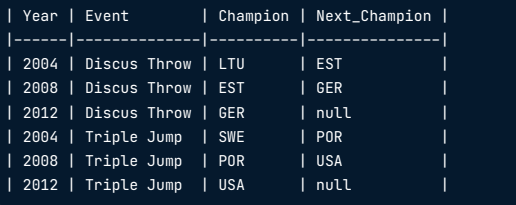

---

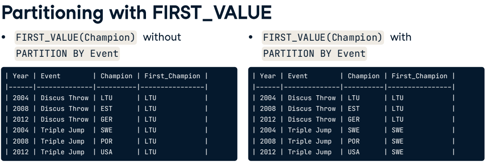

---

---

## ranking

---


---

## paging

---


---

## Aggregate window functions

---


---

## frames

---


